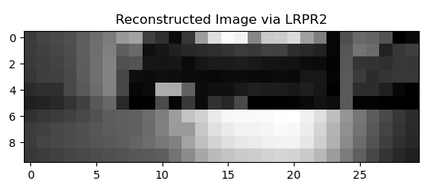

# Low-Rank-Phase-Retrieval

Low Rank Phase Retrieval (LRPR) Implementation via Conjugate Gradient Least Squaresfor solving a matrix of complex valued signals. This implementation is of the algorithm LRPR2 (LRPR via Alternating Minimization) based on the paper "Low Rank Phase Retrieval".

For more information: [https://arxiv.org/abs/1608.04141](https://arxiv.org/abs/1608.04141)

## Programs

The following is a list of which algorithms correspond to which Python script:

* `custom_cgls_lrpr.py` - Customized conjugate gradient least squares (CGLS) solver
* `lrpr_via_cgls.py` - Implementation of AltMinTrunc (LRPR2)
* `lrpr_run.py` - Example on using LRPR implementation
* `generate_lrpr.py` - Generate CDP measurements with input video

## Tutorial

This tutorial can be found in `lrpr_run.py`:

```python
import numpy as np
from lrpr_via_cgls import lrpr_fit
import matplotlib.pyplot as plt
from generate_lrpr import generateLRPRMeasurements


image_name = 'image_tensor_small.npz'
with np.load(image_name) as data:
    tensor = data['arr_0']
n1, n2, q_dim = tensor.shape

L = 3 # number of modulations
m_dim = n1 * n2 * L

images, Y, A = generateLRPRMeasurements(image_name=image_name, m_dim=m_dim, L=L)

U, B = lrpr_fit(Y=Y, A=A, rank=1)

X_hat = U @ B.conj().T
vec_first_image = X_hat[:, 0]

first_image = np.reshape(
    vec_first_image, (images.shape[0], images.shape[1]), order='F')

plt.imshow(np.abs(images[:, :, 0]), cmap='gray')
plt.title('True Image')
plt.show()

plt.imshow(np.abs(first_image), cmap='gray')
plt.title('Reconstructed Image via LRPR2')
plt.show()   

```

## Reconstruction results with CDP Measurements



